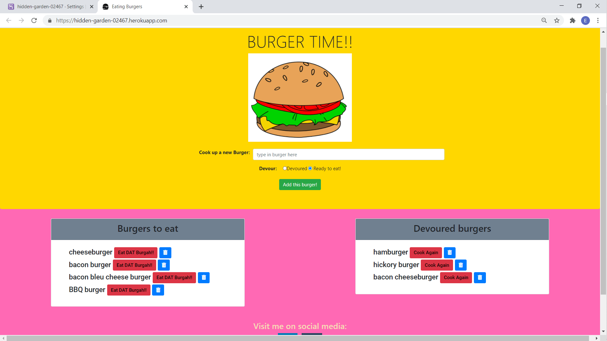

# Eat Dat Burger

## Project Description

This project uses CRUD functions to create, display, update, and delete different types of burgers.  A user can enter a new burger and choose its state ("ready to eat"/"devoured").  There are two lists: one for burgers ready to be eaten and another for devoured burgers.  Users can move burgers back and forth between the lists by choosing the respective button to "Cook Again" or "Eat DAT Burgah!!".  Users can also delete burgers.  

This app utilizes the following technologies:  HTML5, CSS, Bootstrap4, Handlebars, Javascript, NODE.js, Epress.js, and MySQL.

## Table of Contents

* [Title](#project-title)
* [Description](#project-description)
* [Table of Contents](#table-of-contents)
* [Installation](#installation-instructions)
* [Usage](#usage)
* [Contributing](#guidelines-for-contributing)
* [Tests](#tests)
* [Technologies](#technologies-used)
* [Author](#author)
* [Questions](#questions)
* [License](#license)

## Installation Instructions

You can clone this repository,and run it with the terminal command "node server".  Then visit the local host.  Or, [use the app as deployed to Heroku](https://hidden-garden-02467.herokuapp.com/).

## Usage 

[Use this app on Heroku](https://hidden-garden-02467.herokuapp.com/].

Here are four :movie_camera: **VIDEOS** :movie_camera: that display how to use the application.

1. *BACK END* walk through database schema, server, connection, and orm files:

2. *MIDDLE* walk through model, controller, and ajax JavaScript:

3. *FRONT END* walk through handlebars views, html, and local styling:

2. *EAT DAT BURGER* deployed app walk through:

## Guidelines for Contributing

If you would like to make a contribution, or have ideas for future features, please contact the repository owner at the e-mail listed below.

## Tests

Test early, test often!

### Technologies Used 
### :computer: :computer: :computer: :computer: :computer: :computer: 

#### :memo: HTML5 :memo:

**HTML5** is a markup language used for structuring and presenting content on the World Wide Web.  The goals are to improve the language with support for the latest multi-media and other new features; to keep the language both easily readable by humans and consistently understood by computers and devices; and to remain backward compatible to older software.  Many new symantic features are included.

*HTML5* content borrowed from <a target="_blank" rel="noopener noreferrer">[this page](https://en.wikipedia.org/wiki/HTML5).</a>

#### :art: CSS :art:

**Cascading Style Sheets (CSS)** is a stylesheet language used for describing the presentation of a document written in a markup language (such as HTML5).  CSS is designed to enable the separation of presentation and content; including layout, colors, and fonts.  This separation improves content accessibility to provide more flexibility and control in the specification of presentation characteristics, enabling multiple web pages to share formatting by specifying relevant CSS in a separate file, which reduces complexity and repetition in the structural content (HTML), as well as enabling the file to be cached to improve the page load speed between the pages that share the file and its formatting.

Separation of formatting and content also makes it feasible to present the same markup page in different styles for different rendering methods, such as on-screen, in print, by voice, and on Braille-based tactile devices. 

*CSS* content borrowed from <a target="_blank" rel="noopener noreferrer">[this page](https://en.wikipedia.org/wiki/Cascading_Style_Sheets).</a>

#### :shoe: Bootstrap 4 :shoe:

**Bootstrap 4** is a free and open-source CSS framework directed at responsive, mobile-first front-end web development.  It contains CSS and (optionally) JavaScript-based design templates for typography, forms, buttons, navigation, and other interface components.  

*Bootstrap 4* content borrowed from <a target="_blank" rel="noopener noreferrer">[this page](https://en.wikipedia.org/wiki/Bootstrap_(front-end_framework)).</a>

#### :sparkler: JavaScript :sparkler:

**JavaScript (JS)** is one of the core technologies of the World Wide Web (along with HTML and CSS). It enables interactive web pages and is an essential part of web applications.  JS is a multi-faceted, scripting language that provides versatility through Application Programming Interfaces (APIs) and Document Object Model (DOM) manipulation, among others.

*JavaScript* content borrowed from <a target="_blank" rel="noopener noreferrer">[this page](https://en.wikipedia.org/wiki/JavaScript).</a>

#### :globe_with_meridians: NODE.js :globe_with_meridians:

**NODE.js** is an open-source, cross-platform JavaScript runtime environment that execute JavaScript code outside a web browser.  NODE.js lets developers use JavaScript to write command line tools and for server-side scripting.  NODE.js represents a "Javascript everywhere" paradigm, unifying web-application development around a single programming language, rather than different programming languages for server- and client-side scripts.  

*NODE.js* content borrowed from <a target="_blank" rel="noopener noreferrer">[this page](https://en.wikipedia.org/wiki/Node.js).

[Download Node.js](https://nodejs.org/en/).

#### :satellite: Express.js :satellite:

**Express.js** is a minimal and flexible NODE.js web application framework that provides a robust set of features for web and mobile applications.  The myriad HTTP utility methods and middleware allow for the creation of a robust API.  Express.js provides a thin layer of fundamental features, without obscuring NODE.js features.

*Express.js* content borrowed from <a target="_blank" rel="noopener noreferrer">[this page](https://expressjs.com/).</a>

#### :card_index: MySQL :card_index:

**MySQL** is an open-source relational database management system(RDBMS). A relational database organizes data into one or more data tables.  SQL is a language programmers use to create, modify, and extract data from the relational database, as well as control access to the database.

*MySQL* content borrowed from <a target="_blank" rel="noopener noreferrer">[this page](https://en.wikipedia.org/wiki/MySQL).</a>

[Download MySQL](https://dev.mysql.com/downloads/mysql).

#### :neckbeard: Handlebars :neckbeard:

**Handlebars** is a simple *templating language*.  It uses a template and an input object to generate HTML or other text formats.  Handlebars templates look like regular text with embedded Handlebars expressions.

*Handlebars* content borrowed  from <a target="_blank" rel="noopener noreferrer">[this page](https://handlebarsjs.com/guide/).</a>

### Author 

This *Eat Dat Burger* was built by :green_heart: Eric D. Torres :green_heart:

## Questions

Check out my [GitHub profile](https://github.com/etorres-revature).

You can contact me by e-mail at etorresnotary@gmail.com for any additional questions and/ or clarifications you may need about the project.

##### License

[This application uses the **MIT License** found here](./LICENSE).

**[This README.md file generated with my NODE.js README Generator app.](https://github.com/etorres-revature/NODEjs_README.md_Generator)**
